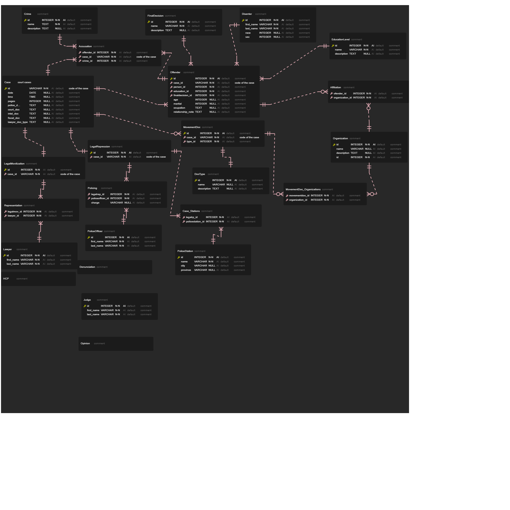

# Overview

**HUC-DB** is a large relational database including multiple tables with information.

This database will serve as a novel collection of tactics of legal repression and legal mobilization in authoritarian contexts.
It will also provide a blueprint for collection of state-movement discursive contentions informing oppositional identity formation in periods of social upheaval.

## Structure

{: .center}

The database encompasses the following tables:

**CourtCase**

**Offender**

**EducationLevel**

**FinalDecision**

**Disenter**

**Organization**

**Affiliation**

**PoliticalOffence**

**PoliceStation**

**Lawyer**

**PoliceOfficer**

**LegalMovilization**

**LegalRepression**
