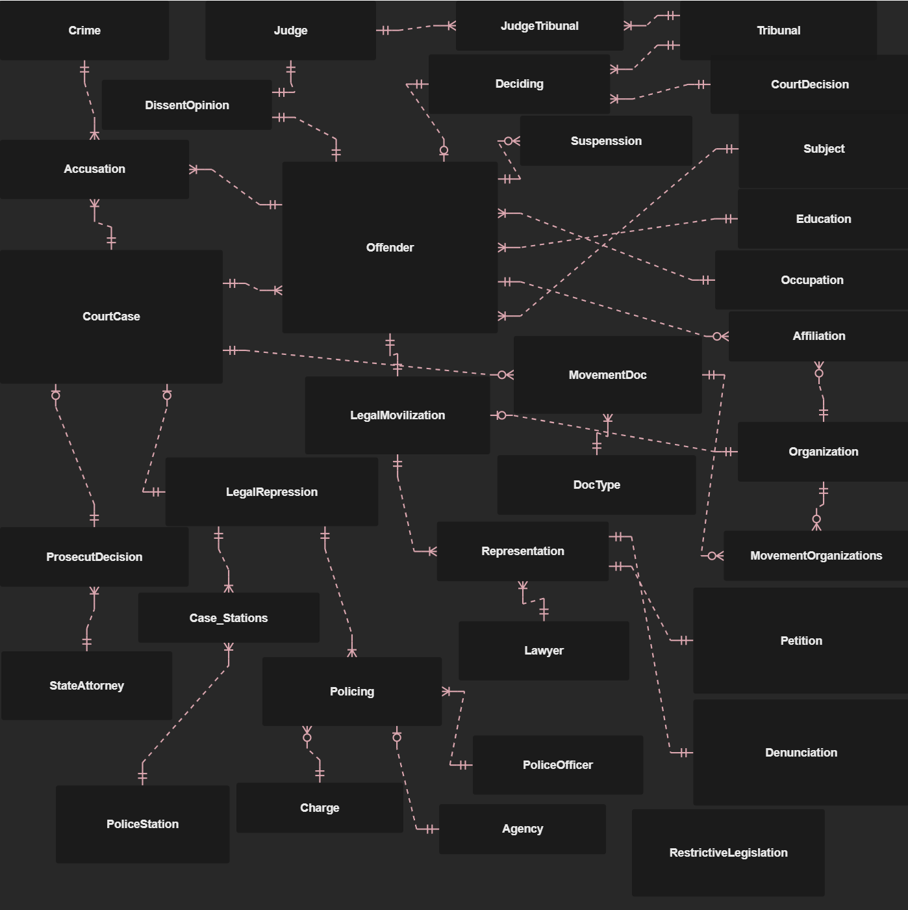
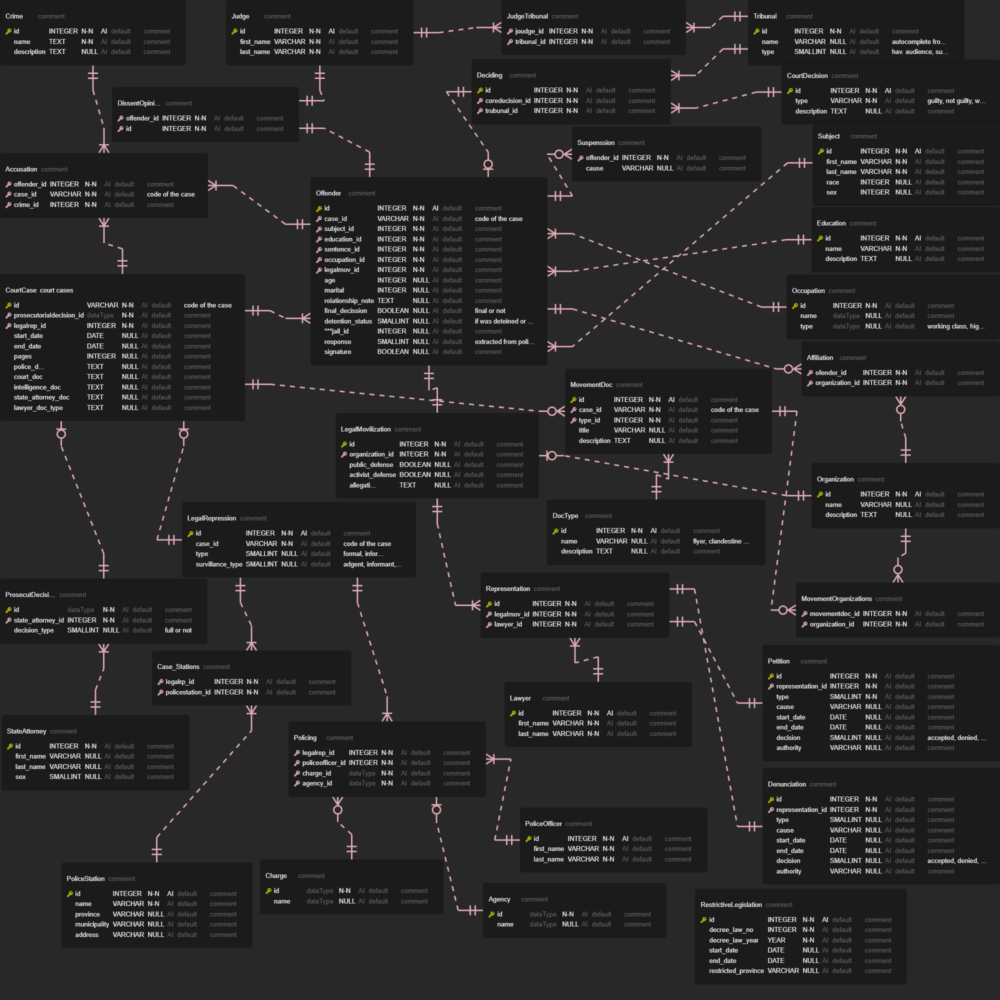

# Overview

**HUC-DB** is a large relational database systematizing historical information from 1000 thousand court cases filed at the Havana Urgency Court against dissenters from 1952 to 1958. 

The HUC data were recovered from the Cuban National Archive (ANC) and the Office for Historical Affairs of the Council of State (OAHCE) and compiled in a digital archive by the state-sponsored Association of Combatants of the Cuban Revolution (ACRC) in 2014. I accessed the HUC archive at the Cuban National Library during a fieldwork trip to Havana in 2018, with the support of the UC-Cuba Academic Initiative. 

## Structure

### Compressed

### Full

This database is a unique resource for researchers and academics interested in tactics of legal repression and legal mobilization in authoritarian contexts. It encompasses the following tables:

**CourtCase**

  **Accussation**
  
  **Crime**
  
  **Prosecutorial Decision**
  
  **State Attorney**

**Offender**

  **Subject**

  **Education**
  
  **Affiliation**
  
  **Occupation**
  
 
**Deciding**  

  **CourtDecision**
  
  **Tribunal**
  
  **JudgeTribunal**
  
  **Judge**
  
  **DissentOpinion**
  
  **Suspension**

**MovDoc**

  **DocType**
  
  **Organization**
  
  **MovementOrganizations**

**LegalRepression**

  **Case_Stations**

  **PoliceStation**

  **Policing**
  
   **PoliceOfficer**
   
   **Agency**
   
   **Charge**
  

**LegalMobilization**

   **Representation**
   
   **Lawyer**
   
   **Petition**
   
   **Denunciation**
   
   
**Restrictive Legislation**
   

